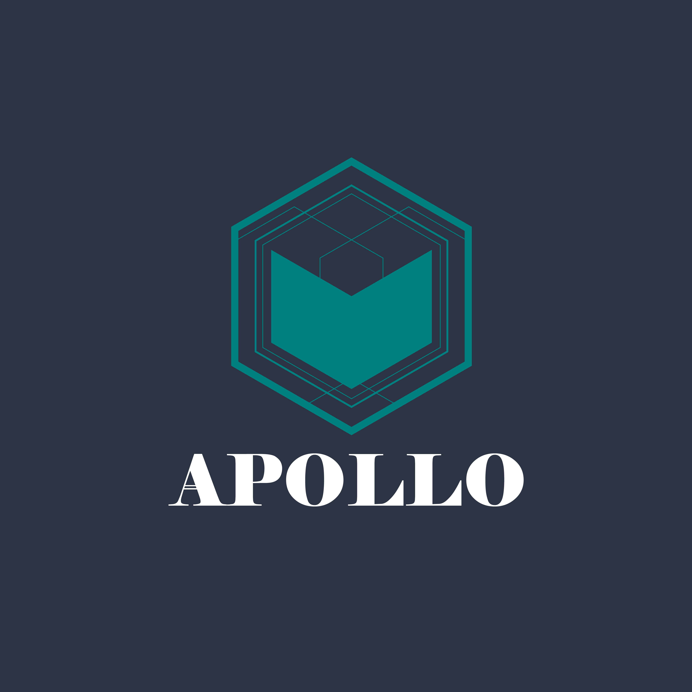

<div align="center">
    
</div>

# Apollo: Pure Golang Cardano Building blocks 
## Pure Golang Cardano Serialization

The Objective of this library is to give Developers Access to each and every needed resource for cardano development.
The final goal is to be able to have this library interact directly with the node without intermediaries.

Little Sample Usage:
```go
package main

import (
    "encoding/hex"
    "fmt"

    "github.com/fxamacker/cbor/v2"
    "github.com/Salvionied/apollo"
    "github.com/Salvionied/apollo/txBuilding/Backend/BlockFrostChainContext"
)

func main() {
    bfc := BlockFrostChainContext.NewBlockfrostChainContext("blockfrost_api_key", int(apollo.MAINNET), apollo.BLOCKFROST_BASE_URL_MAINNET)
    cc := apollo.NewEmptyBackend()
    SEED := "your mnemonic here"
    apollob := apollo.New(&cc)
    apollob = apollob.
        SetWalletFromMnemonic(SEED).
        SetWalletAsChangeAddress()
    utxos := bfc.Utxos(*apollob.GetWallet().GetAddress())
    apollob, err := apollob.
        AddLoadedUTxOs(utxos).
        PayToAddressBech32("addr1qy99jvml0vafzdpy6lm6z52qrczjvs4k362gmr9v4hrrwgqk4xvegxwvtfsu5ck6s83h346nsgf6xu26dwzce9yvd8ysd2seyu", 1_000_000, nil).
        Complete()
    if err != nil {
        fmt.Println(err)
    }
    apollob = apollob.Sign()
    tx := apollob.GetTx()
    cborred, err := cbor.Marshal(tx)
    if err != nil {
        fmt.Println(err)
    }
    fmt.Println(hex.EncodeToString(cborred))
    tx_id, _ := bfc.SubmitTx(*tx)

    fmt.Println(hex.EncodeToString(tx_id.Payload))

}

```
If you have any questions or requests feel free to drop into this discord and ask :) https://discord.gg/MH4CmJcg49

By:
    `Edoardo Salvioni - Zhaata` 
