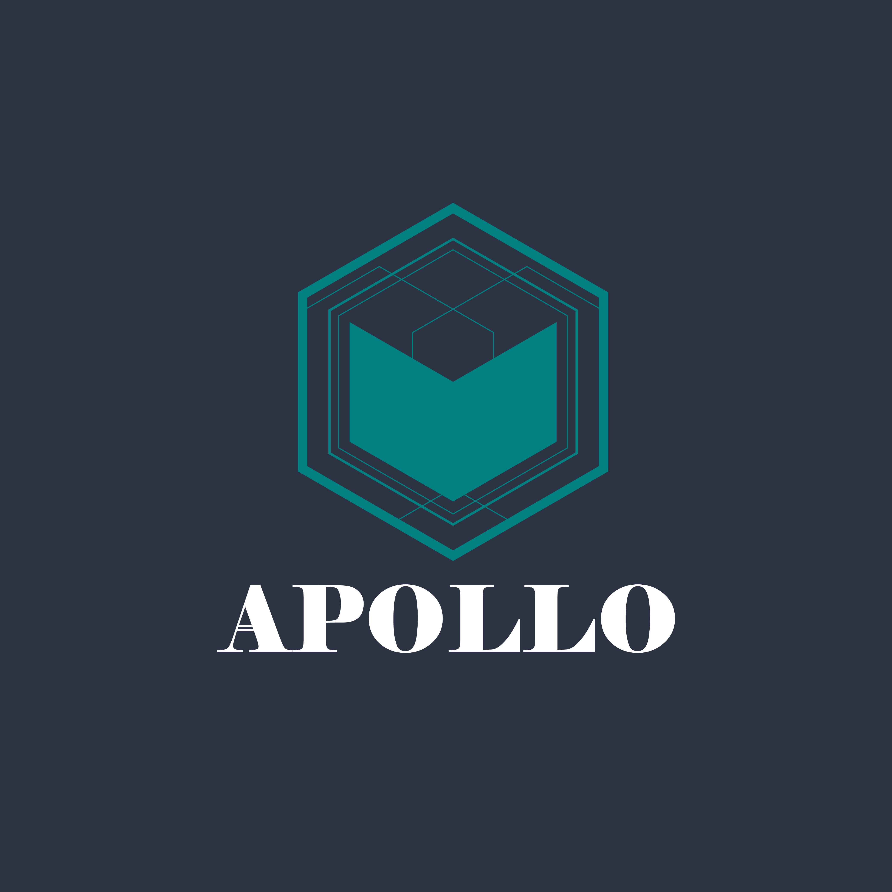

<div align="center">
    
</div>

# Apollo: Pure Golang Cardano Building blocks 
## Pure Golang Cardano Serialization

The Objective of this library is to give Developers Access to each and every needed resource for cardano development.
The final goal is to be able to have this library interact directly with the node without intermediaries.

Little Sample Usage:
```go
package main

import (
    "encoding/hex"
    "fmt"

    "github.com/blinklabs-io/gouroboros/ledger/common"

    apollo "github.com/Salvionied/apollo/v2"
    "github.com/Salvionied/apollo/v2/backend/blockfrost"
)

func main() {
    bfc := blockfrost.NewBlockFrostChainContext(
        "https://cardano-mainnet.blockfrost.io/api/v0",
        1,
        "your_blockfrost_project_id",
    )

    mnemonic := "your mnemonic here"
    a := apollo.New(bfc)
    a, err = a.SetWalletFromMnemonic(mnemonic)
    if err != nil {
        panic(err)
    }

    utxos, err := bfc.Utxos(a.GetWallet().Address())
    if err != nil {
        panic(err)
    }

    receiver, err := common.NewAddress("addr1...")
    if err != nil {
        panic(err)
    }

    a, err = a.AddLoadedUTxOs(utxos...).
        PayToAddress(receiver, 1_000_000).
        Complete()
    if err != nil {
        panic(err)
    }

    a, err = a.Sign()
    if err != nil {
        panic(err)
    }

    txCbor, err := a.GetTxCbor()
    if err != nil {
        panic(err)
    }
    fmt.Println(hex.EncodeToString(txCbor))

    txId, err := a.Submit()
    if err != nil {
        panic(err)
    }
    fmt.Println(hex.EncodeToString(txId.Bytes()))
}
```
## Coin Selection

Apollo selects transaction inputs with **MACS** (Multi-Asset Coin Selection,
[IEEE Blockchain 2023](https://doi.org/10.1109/Blockchain60715.2023.00029)) by
default. MACS prioritizes UTxOs by value and closeness to the pool's average,
covering each asset in the target directly. Compared to the legacy
largest-first strategy it selects far fewer inputs on multi-asset targets
(15 vs 785 in our 1k-UTxO benchmark), produces much smaller change, and sweeps
dust UTxOs so they don't accumulate in your wallet.

The algorithm is pluggable via the `CoinSelector` interface:

```go
// Default: MACS with dust sweeping (UTxOs under 1 ADA, max 2 per tx)
a := apollo.New(bfc)

// Legacy largest-first behavior
a = a.SetCoinSelector(&apollo.LargestFirstSelector{})

// MACS without dust sweeping, or with custom limits
a = a.SetCoinSelector(&apollo.MACSSelector{})
a = a.SetCoinSelector(&apollo.MACSSelector{DustThreshold: 2_000_000, MaxDustInputs: 4})
```

Benchmarks live in `coinselection_bench_test.go`
(`go test -bench BenchmarkCoinSelection`), and the design notes with full
results are in `docs/design/2026-06-11-macs-coin-selection-design.md`.

## Evaluation witnesses

When a script transaction has required signers, Apollo supplies valid,
evaluation-only witnesses to the execution-unit evaluator. `BursaWallet`
provides its payment and stake witnesses automatically. Watch-only,
hardware, and remote wallets can provide the required signatures without
changing the `Wallet` interface:

```go
type remoteEvaluationSigner struct{}

func (remoteEvaluationSigner) EvaluationWitnesses(
    bodyHash common.Blake2b256,
    required []common.Blake2b224,
) ([]common.VkeyWitness, error) {
    // Return valid witnesses for any requested hashes controlled remotely.
    return nil, nil
}

a.AddEvaluationWitnessProvider(remoteEvaluationSigner{})
```

These signatures are used only for `EvaluateTx`; they are not retained in the
final unsigned transaction.

If you have any questions or requests feel free to drop into this discord and ask :) https://discord.gg/MH4CmJcg49

By:
    `Edoardo Salvioni - Zhaata` 
